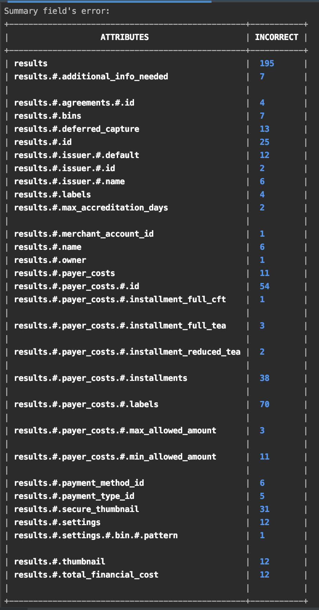

# jsonparator

jsonparator compares HTTP GET JSON responses from different hosts by checking if they respond with the same json (deep equal ignoring order) and status code.<br>
At the end of process you will find two folders (in the same location of base path) with the file cuts by params and by error's field comparison. 

## Download and install

    export GO111MODULE=on;go get -u github.com/mauropons/jsonparator

## Create a file with relative URL

    eg:

    /v1/payment_methods?client.id=1
    /v1/payment_methods?client.id=2
    /v1/payment_methods?client.id=3

## Run

```sh
    jsonparator 
    -P "/path/to/file/with/urls" 
    -host "https://host1.com" 
    -host "https://host2.com" 
    -H "X-Auth-Token:82f14bd9f202e172d078d5589fd8d0d8532c08654f09763c15f84dccc81b7906"
    -V 2 
    -E "results.#.payer_costs.#.payment_method_option_id" 
    -E "paging" 
    -M "marketplace"
```

## Options

#### `--help, -h`
Shows a list of commands or help for one command

#### `--version, -v`
Print the version

#### `--path value, -P`
Specifies the file from which to read targets. It should contain one column only with a rel path. eg: /v1/cards?query=123

#### `--host value`
Targeted hosts. Exactly 2 hosts must be specified. eg: --host 'http://host1.com --host 'http://host2.com'

#### `--header value, -H value`
Headers to be used in the http call

#### `--velocity value, -V value`
Set comparators velocity in K RPM (default: 4)

#### `--exclude value, -E value`
Excludes a value from both json for the specified path. A path is a series of keys separated by a dot or ".#."<br>
Default "results.#.payer_costs.#.payment_method_option_id"

#### `--requestNotContainParam, -M value`
Save requests that not contains params parametrized.

## Path syntax

Given the following json input:

```json
{
  "name": {"first": "Tom", "last": "Anderson"},
  "friends": [
	{"first": "James", "last": "Murphy"},
	{"first": "Roger", "last": "Craig"}
  ]
}
```

<table>
<thead><tr><th>path</th><th>output</th></tr></thead>
<tbody>
<tr><td><b>"name.friends"</b></td><td>

```json

{
    "name": {"first": "Tom", "last": "Anderson"}
}

```
</td></tr>
<tr><td><b>"friends.#.last"</b></td><td>

```json

{
    "name": {"first": "Tom", "last": "Anderson"},
    "friends": [
        {"first": "James"},
        {"first": "Roger"}
    ]
}

```

</td></tr>

</tbody></table>

#### `Run consecutive comparisons`
Create a sh file with the next code and change vars values. ;) 

```console
#!/bin/bash

# sysinfo_page - A script to run all comparators

##### Constants

AUTH_TOKEN="8b2e19e9f224ce2fab8a682672e072fdef5c3aa0ea9752a680cf23529ef2b293"
SCOPE_1="https://read-batch_payment-methods.furyapps.io"
SCOPE_2="https://production-reader-testscope_payment-methods-read-v2.furyapps.io"
ARRAY_PATHS=(
	"/PATH/MELI/MLM/MLM.csv"
	"/PATH/MELI/MCO/MCO.csv"
	"/PATH/NONE/MLM/MLM.csv"
	"/PATH/NONE/MCO/MCO.csv"
	) 

#ARRAY_CHANNELS=("" "point" "splitter" "instore")
ARRAY_CHANNELS=("")

for i in "${ARRAY_PATHS[@]}"
do
	for j in "${ARRAY_CHANNELS[@]}"
	do
		gomparator -path "$i" -host "${SCOPE_1}" -host "${SCOPE_2}" -header "X-Auth-Token:${AUTH_TOKEN}" -header "X-Caller-Scopes:$j"
	done
done

```

# `Example`
## Execute cmd

## Running

## Summary field's error

## Summary field's cuts
